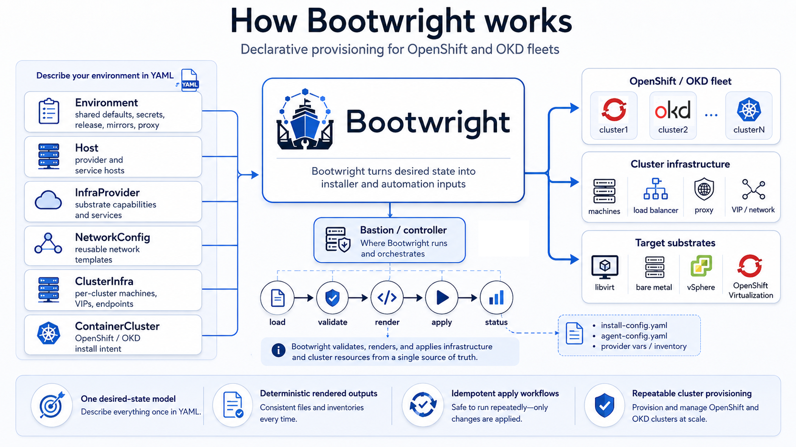

<p align="center">
  
</p>

# Bootwright

Bootwright is a desired-state orchestrator for provisioning fleets of OpenShift
and OKD clusters from bare hardware or virtualized substrates. You describe the
environment, providers, shared components, infrastructure, networks, clusters,
and bootstrap extensions with ten declarative YAML kinds. Bootwright validates
that intent, renders the deterministic input files expected by installer and
provider CLIs, and coordinates each phase idempotently.

**Supported distributions:** OpenShift and OKD.

## The problem it solves

Standing up one cluster is a runbook. Standing up *many* clusters — across mixed substrates, with shared services like load balancers, DNS, mirror registries, and proxies — is a coordination problem that handwritten scripts and ad-hoc installer runs cannot keep consistent. Bootwright replaces that with a few versioned objects and an idempotent apply pipeline: declare the fleet once, converge it as many times as you need, and get the same result every time.

The CLI covers the provisioning pipeline:

```text
bootwright example init lab --output ./lab-input
bootwright context init lab -f ./lab-input
bootwright context validate
bootwright secret set openshift-pull-secret --pull-secret ~/openshift-pull-secret.json
bootwright secret generate
bootwright secret materialize
bootwright check syntax
bootwright check bastion
bootwright apply bastion --yes
bootwright check infra
bootwright apply infra --dry-run
bootwright apply infra --yes
bootwright check cluster
bootwright apply cluster --dry-run
bootwright apply cluster --yes
bootwright check extensions
bootwright apply extensions --dry-run
bootwright apply extensions --yes
bootwright status --watch
```

<p align="center">
  
</p>

## Start Here

The user-facing docs are published from [`docs/`](docs/) as this [link](https://crmarques.github.io/bootwright/). Browse them in-tree or once Pages is enabled on the repo:

| Audience | Start |
| --- | --- |
| Newcomers | [Home](docs/index.md) and [Concepts](docs/concepts.md) |
| First context and apply flow | [Getting Started](docs/getting-started.md) |
| Authoring real environments | [Advanced](docs/advanced/) — providers, networking, proxy/disconnected, secrets |
| Contributors and coding agents | [Specs](specs/index.md) |
| Architecture decisions | [ADRs](specs/adr/README.md) |

Docs explain the workflow. Specs are the source of truth for API
shape, architecture boundaries, validation rules, CLI behavior, and
security posture.

Canonical desired-state examples live under [`examples/`](examples/). E2E
fixtures under [`test/e2e/`](test/e2e/) are runnable test assets.

## Install The CLI

Download the `bootwright` binary for your platform from
[GitHub Releases](https://github.com/crmarques/bootwright/releases), then
install it on your `PATH`:

```bash
chmod +x bootwright
sudo install -m 0755 bootwright /usr/local/bin/bootwright
bootwright version
```

If a release binary is not available yet, build the CLI from the repository
root with the [`Containerfile`](Containerfile) and copy the binary out of the
image:

```bash
export HTTP_PROXY
export HTTPS_PROXY="${HTTP_PROXY}"
export NO_PROXY="localhost,127.0.0.1,.local,10."
export http_proxy="${HTTP_PROXY}"
export https_proxy="${HTTPS_PROXY}"
export no_proxy="${NO_PROXY}"

DOCKER_BUILDKIT=1 docker build \
  --build-arg "HTTP_PROXY=${HTTP_PROXY}" \
  --build-arg "HTTPS_PROXY=${HTTPS_PROXY}" \
  --build-arg "NO_PROXY=${NO_PROXY}" \
  --build-arg "http_proxy=${http_proxy}" \
  --build-arg "https_proxy=${https_proxy}" \
  --build-arg "no_proxy=${no_proxy}" \
  -t bootwright \
  -f Containerfile \
  .

docker create --name bootwright-bin bootwright
docker cp bootwright-bin:/usr/local/bin/bootwright ./bootwright
docker rm bootwright-bin
sudo install -m 0755 ./bootwright /usr/local/bin/bootwright
bootwright version
```

## Desired-State Contract

User-authored YAML uses `apiVersion: bootwright.io/v1alpha1` and ten kinds:

| Kind | Owns |
| --- | --- |
| `Environment` | Shared environment defaults: selected resource files, cluster selection, base domain, secret sources, service access catalog, proxy selection, registry defaults, and component image pins |
| `Host` | Neutral named addresses, SSH endpoint selection, and generic capability tags (`libvirt`, `container-runtime`); referenced by providers and infra components |
| `InfraProvider` | Named provider capability lists — `machineProfiles` and explicit `machines` — with names scoped per kind |
| `InfraComponent` | Host-bound shared infra services such as artifact servers, load balancers, proxies, name resolution, and registries |
| `NetworkConfig` | Installer `machineNetwork[]` plus reusable NMState host templates for agent installs |
| `ClusterInfra` | One cluster's wiring: platform render mode, endpoints, and selected machines under `components.machines[]` |
| `ContainerCluster` | Provider-neutral OpenShift or OKD intent: distribution, release, install mode, cluster networking, pools, and node-to-machine binding |
| `ClusterExtension` | A reusable post-install component applied inside an installed OpenShift or OKD cluster |
| `ClusterExtensionSet` | An ordered reusable group of extensions and extension sets |
| `ClusterExtensionBinding` | A binding from extensions or extension sets to selected clusters |

`ContainerCluster` stays provider-neutral. Swapping from libvirt with
Redfish emulation to real bare metal edits the substrate-owned objects:
`InfraProvider`, `InfraComponent`, `NetworkConfig`, and the cluster
infrastructure machine bindings.
Post-install components intentionally stay outside
`ContainerCluster.spec.install`; they are separate desired-state resources
selected by `Environment`, bound to clusters, and applied after cluster
installation.

Current `apply` support is explicit: libvirt with emulated Redfish BMCs and
bare metal with Redfish virtual media are converged by the shipped Ansible
workflows. vSphere and OpenShift Virtualization (KubeVirt) remain schema paths
until their provider roles are converged; IPMI is not apply-supported today.

## CLI

```text
bootwright example init lab --output ./lab-input
bootwright context init lab -f ./lab-input
bootwright context validate
bootwright context current
bootwright secret list
bootwright secret set openshift-pull-secret --pull-secret ~/openshift-pull-secret.json
bootwright secret generate
bootwright secret materialize
bootwright secret list
bootwright print-env [--sensitive]
bootwright check syntax
bootwright check bastion
bootwright apply bastion --yes
bootwright check all --dry-run
bootwright apply infra --dry-run
bootwright apply infra --yes
bootwright render installer --scope demo-ocp
bootwright render --output-dir ./rendered --scope demo-ocp --sensitive
bootwright apply cluster --yes
bootwright check extensions
bootwright apply extensions --dry-run
bootwright apply extensions --yes
bootwright status
bootwright status --watch
bootwright destroy cluster --yes
bootwright destroy infra --yes
bootwright destroy infra --scope http-server --yes
```

The CLI is verb-first; every subcommand picks a target. Provisioning
targets are `bastion`, `infra`, `cluster`, and `all`. Verbs are
`context`, `example`, `print-env`, `secret`, `check`, `status`, `render`, `apply`,
`destroy`, and `version`. The formal CLI contract lives in
[specs/state-model.md](specs/state-model.md#cli-contract).

Human text output is designed for operators and may evolve. Use
`--output json` where available for automation. `bootwright print-env`
intentionally prints raw shell exports. Single-cluster apply runs stream native
Ansible output; multi-cluster apply runs keep Ansible output in per-task and
per-cluster logs while the terminal shows cluster log paths and high-level
progress.

`bootwright render --output-dir ./rendered --scope <cluster> --sensitive`
exports concrete external CLI inputs, including
`openshift-install/<cluster>/{install,agent}-config.yaml`, for operators who
want to run supplier or community tools such as `openshift-install` themselves.
Treat that output as local runtime material because it contains secrets.

## Repository Layout

```text
specs/      Source-of-truth definitions for humans and agents
docs/       Human workflow documentation
examples/   Safe-to-commit desired-state examples
.agents/    Project-local coding-agent skills
api/        Versioned desired-state types
cmd/        CLI entrypoints
internal/   Private implementation packages
ansible/    Embedded workflow playbooks and roles
test/       Test fixtures and end-to-end cases
```

Versioned content (specs, docs, fixtures) must stay safe to commit: no
kubeconfigs, pull secrets, private keys, tokens, plaintext credentials,
personal usernames, or private absolute paths.
