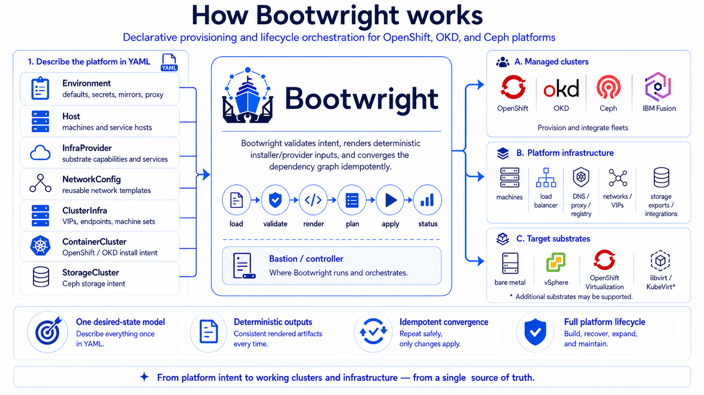

<p align="center">
  
</p>

# Bootwright

Bootwright is a desired-state orchestrator for turning cloud platform intent
into reality. It can provision a complete platform from scratch or converge an
isolated component for build-out, recovery, or maintenance. You describe
substrates, machines, managed machine OS installs, networks, shared
infrastructure services, OpenShift or OKD managed clusters, Ceph storage
clusters, storage exports, and bootstrap add-ons with declarative YAML kinds.
Bootwright validates that intent, renders deterministic inputs for the official
installer, provider, storage, and cluster CLIs, and applies the dependency graph
idempotently so those pieces become one coherent cloud platform.

**Supported cluster families:** OpenShift, OKD, and Ceph — across bare metal,
vSphere, KubeVirt, and libvirt.

## The problem it solves

Standing up one cluster is a runbook. Standing up a cloud platform is a
coordination problem: machines may need substrate preparation or OS install,
clusters need shared services such as load balancers, DNS, mirror registries,
proxies, and artifact servers, storage may be imported or built as Ceph, and
early add-ons need to wait for installed clusters and exported storage.
Handwritten scripts and ad-hoc installer runs do not keep those relationships
consistent. Bootwright replaces them with versioned objects and an idempotent
apply graph: declare the platform once, converge the whole graph or a selected
component, and get the same result every time.

The CLI covers the normal convergence path:

```text
bootwright example init --name lab --output-dir ./lab-input
bootwright validate -f ./lab-input
bootwright context init --name lab -f ./lab-input
bootwright secret set --name openshift-pull-secret --pull-secret ~/openshift-pull-secret.json
bootwright secret generate
bootwright secret check
bootwright machine trust
bootwright bastion setup --yes
bootwright preflight all
bootwright render effective
bootwright plan
bootwright apply --yes
bootwright status --watch
bootwright cluster info
```

`apply` is the normal convergence path. Use `--stage infra` to prepare
providers, infra services, and selected machines, or `--stage clusters` to
install selected container and storage clusters, add-ons, and integrations.
`--stage` and `--through` together select an inclusive range of stages: `--stage`
is the first phase to run, `--through` the last. `--stage X` alone runs only that
stage; `--through X` alone runs every phase from the beginning up to and including
`X` (a cumulative prefix), e.g. `apply --through base`; combined,
`apply --stage deps --through base` runs the deps..base range; `--through end`
runs through the final phase. A family endpoint means through its last phase, so
`--through infra` equals `--through machines` and `--through clusters` is the full
graph. Both flags are available on `apply`, `plan`, and `diff`.
(`machine trust` pre-records SSH host-key trust; scripted runs like `apply --yes`
require it, while interactive `preflight`/`apply` runs can instead confirm
each unknown host's fingerprint on first use.)
Use `--clusters <name>[,<name>...]` to converge or recover isolated
`ContainerCluster` and `StorageCluster` components without applying the whole
platform. `destroy` uses the same `--stage infra|clusters` and `--clusters`
selector shape; omitting `--stage` tears down the whole context (clusters first,
then the infra they ran on). Unscoped `destroy --stage infra` performs
current-context VM cleanup.

<p align="center">
  
</p>

## Start Here

The user-facing docs are published at
[https://crmarques.github.io/bootwright/](https://crmarques.github.io/bootwright/)
and can also be browsed in-tree under [`docs/`](docs/).

| Audience | Start |
| --- | --- |
| Newcomers | [Home](docs/index.md) and [Getting Started](docs/getting-started/index.md) |
| Understanding the model and the schema | [Concepts and APIs](docs/concepts/index.md) — the desired-state model plus field-level reference per domain |
| Authoring real environments | [Advanced Scenarios](docs/advanced/index.md) — fleets, disconnected/proxied, managed OS, Ceph, KubeVirt, networking, ownership & safety, operations |
| When something fails | [Troubleshooting](docs/troubleshooting.md) |
| Contributing to Bootwright | [Contributing](docs/contributing/index.md) — the API contract and architecture internals |
| Contributors and coding agents | [Specs](specs/index.md) |
| Architecture decisions | [ADRs](specs/adr/README.md) |

Docs explain the workflow. Specs are the source of truth for API
shape, architecture boundaries, validation rules, CLI behavior, and
security posture.

Canonical desired-state examples live under [`examples/`](examples/). E2E
fixtures under [`test/e2e/`](test/e2e/) are runnable test assets.

## Install The CLI

Download the `bootwright` binary for your platform from
[GitHub Releases](https://github.com/crmarques/bootwright/releases), then
install it on your `PATH`:

```bash
chmod +x bootwright
sudo install -m 0755 bootwright /usr/local/bin/bootwright
bootwright version
```

If a release binary is not available yet, build the CLI from the repository
root with the [`Containerfile`](Containerfile) and copy the binary out of the
image:

```bash
export NO_PROXY="localhost,127.0.0.1,.local,10."

DOCKER_BUILDKIT=1 docker build \
  --secret id=proxy,src=proxy.env \
  --build-arg "NO_PROXY=${NO_PROXY}" \
  --build-arg "no_proxy=${NO_PROXY}" \
  -t bootwright \
  -f Containerfile \
  .

docker create --name bootwright-bin bootwright
docker cp bootwright-bin:/usr/local/bin/bootwright ./bootwright
docker rm bootwright-bin
sudo install -m 0755 ./bootwright /usr/local/bin/bootwright
bootwright version
```

> **Building behind an authenticated proxy.** The `--secret id=proxy,src=proxy.env`
> line above keeps the credential out of build-args, `ENV`, and image layers: copy
> [`proxy.env.example`](proxy.env.example) to `proxy.env`, fill in the real
> `user:password@host`, and pass it as the BuildKit secret shown. The file is
> git-ignored, mounted on a tmpfs only during each network step, and absent from
> the finished image and `docker history`. Omit `--secret` entirely to build
> without a proxy. `NO_PROXY` is not sensitive, so it stays an ordinary build-arg.

## Desired-State Contract

User-authored YAML uses `apiVersion: bootwright.io/v1alpha1` and twenty-one kinds:

| Kind | Owns |
| --- | --- |
| `Environment` | Shared environment defaults: selected resource files or directories, cluster selection, base domain, secret sources, service access catalog, proxy selection, registry defaults, and component image pins |
| `Entitlement` | Named vendor-controlled content access for one product (`spec.type`): RHSM subscription (with optional Satellite), vendor registry credentials, and license, referenced by `StorageCluster` and `MachineImage` |
| `Machine` | Raw, Bootwright-managed, or externally installed machine desired state: substrate binding, OS mode, install network, named addresses, SSH, and capabilities |
| `MachineImage` | Bootwright-managed OS install media such as trusted base ISOs |
| `MachineInstallProfile` | Bootwright-managed OS installation profile, installer type, repositories, storage, SSH, packages, services, SELinux, firewall, and FIPS install customizations |
| `InfraProvider` | Provider capability, substrate profiles, provider connection facts, and network attachments |
| `InfraComponent` | Machine-bound shared infra services such as artifact servers, load balancers, proxies, name resolution, and registries |
| `NetworkConfig` | Installer `machineNetwork[]` plus reusable NMState host templates for agent installs |
| `ContainerCluster` | OpenShift or OKD intent: distribution, release, install mode, platform render mode, endpoints, artifact access, cluster networking, pools, and node-to-machine binding |
| `StorageCluster` | External storage intent: imported Ceph, or Bootwright-managed Ceph through cephadm on OS-ready or Bootwright-installed nodes |
| `StoragePlacementPolicy` | Storage placement policy such as the CRUSH rule and replicated pool defaults used by Ceph pools |
| `StoragePool` | Ceph pool desired state, role, placement policy, and replication settings |
| `StorageFilesystem` | CephFS desired state, including distinct metadata and data pools plus MDS placement |
| `StorageObjectGateway` | RGW desired state, public endpoint, and cephadm ingress VIP placement |
| `StorageNFSExport` | NFS-Ganesha service desired state: CephFS or RGW exports and cephadm ingress VIP placement |
| `StorageExport` | Exported storage surface prepared for downstream consumers such as Data Foundation external mode |
| `ClusterAddon` | A reusable post-install component applied inside an installed OpenShift or OKD cluster |
| `ClusterAddonProfile` | An ordered reusable group of add-ons and nested profiles |
| `ClusterAddonBinding` | One installed cluster's post-install bootstrap set: add-ons, profiles, and binding-scoped add-on inputs |
| `Playbook` | An operator-supplied Ansible playbook injected into the provisioning DAG at a chosen sub-phase, with optional vendored roles and collections |
| `Secret` | Named secret material a `SecretRef` resolves to: its type (opaque, token, username/password, docker config, CA bundle, TLS certificate, or SSH key pair) and its source (literal, file, or Bootwright-generated) |

`ContainerCluster` owns install intent while machines own substrate and OS
facts. Swapping from libvirt with Redfish emulation to real bare metal edits
`Machine`, `InfraProvider`, `InfraComponent`, and `NetworkConfig` objects
without reintroducing a separate machine-infrastructure resource.
Post-install components intentionally stay outside
`ContainerCluster.spec.install`; they are separate desired-state resources
selected by `Environment`, bound to clusters, and applied after cluster
installation.
External storage provisioning is also separate from `ContainerCluster`.
`StorageCluster` uses the same lower-layer `Machine` and `InfraProvider`
objects for machine facts, while storage-export attachments are declared as
add-on input effects and wait for both the storage cluster and a `ClusterAddon`
that provides `dataFoundation`. Bootwright supports imported external Ceph via
an ODF external-cluster-details secret and managed Ceph where Ansible installs
cephadm prerequisites on ready or Bootwright-installed storage nodes.

Current `apply` support is explicit: Bootwright converges OpenShift and OKD
agent clusters on libvirt with emulated Redfish BMCs, bare metal with Redfish
virtual media, KubeVirt VMs hosted by OpenShift Virtualization, and
vCenter-managed vSphere VMs. It also converges managed or imported Ceph storage
clusters through cephadm and binds storage exports to installed clusters through
add-on inputs. IPMI is not apply-supported today.

## CLI

```text
bootwright example init --name lab --output-dir ./lab-input
bootwright validate -f ./lab-input
bootwright context init --name lab -f ./lab-input
bootwright context current
bootwright cluster list
bootwright cluster info
bootwright cluster info --name demo-ocp
bootwright secret list
bootwright secret set --name openshift-pull-secret --pull-secret ~/openshift-pull-secret.json
bootwright secret generate
bootwright secret check
bootwright machine trust
bootwright secret list
bootwright validate
bootwright bastion setup --yes
bootwright preflight all
bootwright render effective
bootwright plan
bootwright apply --yes
bootwright status --watch
bootwright cluster info
bootwright preflight all --dry-run
bootwright apply --stage infra --dry-run
bootwright apply --stage infra --yes
bootwright render installer --clusters demo-ocp
bootwright render storage --clusters ceph-stretch
bootwright render --output-dir ./rendered --clusters demo-ocp --sensitive
bootwright apply --stage clusters --clusters ceph-stretch --yes
bootwright apply --stage clusters --yes
bootwright apply --through base --yes
bootwright preflight add-ons
bootwright status
bootwright destroy --yes
bootwright destroy --stage clusters --yes
bootwright destroy --stage infra --yes
bootwright destroy --stage infra --clusters artifact-server --yes
```

The CLI is organized into domain command groups (Setup, Resource, Inspect,
Lifecycle, General). `bastion setup` remains a
separate prerequisite command; its read-only dependency checks run under
`preflight bastion`. Graph apply and destroy use
`--stage infra|clusters`; omitting `--stage` applies the full graph for `apply`
and tears down the whole context for `destroy` (clusters then infra). Top-level
groups are `validate`,
`context`, `machine`, `bastion`, `cluster`, `example`,
`media`, `secret`, `add-ons`, `preflight`, `status`, `diff`, `plan`,
`render`, `apply`, `destroy`, and `version`. The formal CLI contract lives in
[specs/state-model.md](specs/state-model.md#cli-contract).

Human text output is designed for operators and may evolve. Use
`--output json` where available for automation. `bootwright cluster info` prints
URLs, local kubeconfig paths, and kubeadmin password retrieval commands, but
never prints kubeconfig or password bytes. Apply runs keep native Ansible, `oc`,
SSH, SCP, Ceph, and installer process output in run, task, and cluster logs
while the terminal shows a ledger-backed fleet dashboard with log paths,
phase status, running work, and concise failures. `bootwright apply --yes` is
the normal end-to-end workflow. The `--stage` and `--clusters` selectors scope
apply and destroy to one stage or to named clusters for build-out, recovery, or
teardown; see [Operations and Recovery](docs/advanced/operations.md) for the
full stage and selector semantics.

`bootwright render --output-dir ./rendered --clusters <cluster> --sensitive`
exports concrete external CLI inputs, including
`openshift-install/<cluster>/{install,agent}-config.yaml`, for operators who
want to run supplier or community tools such as `openshift-install` themselves.
Treat that output as local runtime material because it contains secrets.
`bootwright render effective` writes the normalized desired state with defaults
applied to the current context rendered directory for inspection before apply.
`bootwright plan` previews the full apply task graph without mutating remote
systems.

## Repository Layout

```text
specs/      Source-of-truth definitions for humans and agents
docs/       Human workflow documentation
examples/   Safe-to-commit desired-state examples
.agents/    Project-local coding-agent skills
api/        Versioned desired-state types
cmd/        CLI entrypoints
internal/   Private implementation packages
ansible/    Embedded `bootwright.core` Ansible collection and dependency lock
scripts/    Ansible bundle packing and verification tooling
test/       Test fixtures and end-to-end cases
```

Versioned content (specs, docs, fixtures) must stay safe to commit: no
kubeconfigs, pull secrets, private keys, tokens, plaintext credentials,
personal usernames, or private absolute paths.
