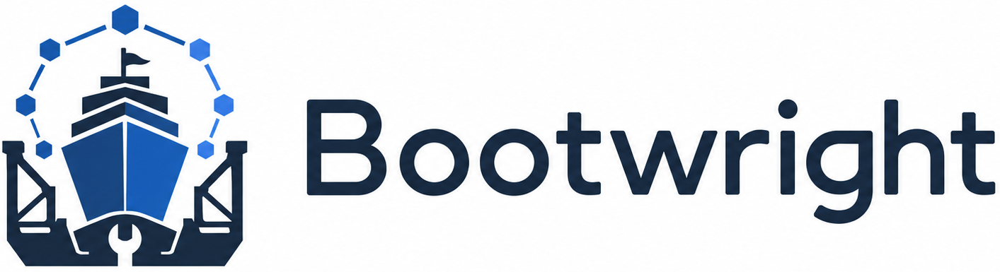

  

Bootwright orchestrates provisioning for fleets of OpenShift and OKD clusters
from declarative desired state. You describe the environment, provider hosts,
substrate inventory, network templates, cluster infrastructure, storage
clusters, and cluster install intent; Bootwright validates that input, renders
the deterministic files expected by provider, installer, storage, and cluster
CLIs, and coordinates the provisioning phases idempotently.

[Get Started](getting-started.md){ .md-button .md-button--primary }
[Learn the Concepts](concepts.md){ .md-button }

## How It Works

  

The detailed schema contract lives in
[`specs/state-model.md`](https://github.com/crmarques/bootwright/blob/main/specs/state-model.md).
